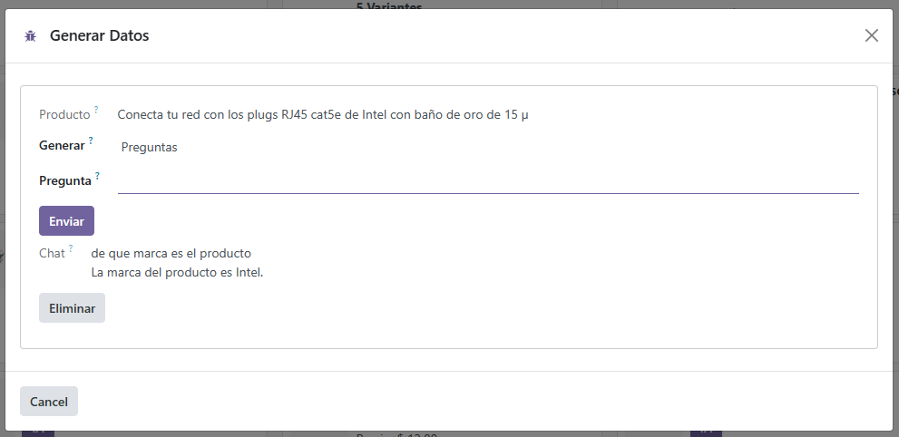

# Nombre del modulo
openai

# openai_api
instalación de la librería de OpenAI
ingresar en la terminal de comandos de WSL y insertar el siguiente comando para entrar en el contenedor de docker

sudo docker exec -it CONTAINER_ID bash
Reemplaza CONTAINER_ID con el ID del contenedor al que deseas acceder

Después se ejecutara el siguiente comando para la instalación de la librería de OpenAI

pip install openai

y con "from openai import OpenAI" ya se podrá utilizar la librería del api

# Descripcion
Este módulo permite la generación de títulos y descripciones además de poder contestar preguntas sobre los productos con la información colocada en "atributos y variantes" del módulo de inventario en el apartado de productos.

# Requisitos
- Odoo17
- Python 3.7+
- Librería de OpenAI y su ApiKey

# Como crear parametros del sistema OpenAI_key y OpenAI_model
La creación de los parámetros del sistema es fundamental para que el módulo de OPENIA sea funcional

Ir al apartado de ajustes

Dar clic en parámetros del sistema en la sección de parámetros dentro de Técnico

dar clic en el botón de Nuevo, en el campo clave colocar "OpenAI_api" y en el valor colocar la APIKEY correspondiente y dar en el botón de guardar cambios

para la creación del parámetro OpenAI_model son los mismos pasos, pero en campo clave colocamos "OpenAI_model" y en valor el modelo de gpt que se desea usar en este caso se utilizara "gpt-3.5-turbo"

# Agregar datos para realisar la generacion de tituilos y descriccion
Entrar al apartado de ajuste y seleccionar OpenAI donde se mostrará dos campos que serán necesarios llenar para el correcto funcionamiento del modulo

Los campos son pregunta para generar títulos que se recomienda poner "Genera 5 títulos para la venta" y pregunta para generar descripciones que se recomienda poner "Genera 1 descripción para la venta"

# instalación de Modulo "openai"
Buscar el módulo "openai" en odoo

después presionar el botón de activar y esperar a que se complete su instalación.

# Uso
## Generar títulos y descripción
Entra al módulo de inventario en el apartado de productos

dar en el botón de IA en el producto del que se desea utilizar

se desplegará un wizard donde podremos seleccionar lo que queremos generar como títulos, descripción y la posibilidad de contestar preguntas sobre el producto seleccionado

también si un producto cuenta con atributos podrá seleccionar que atributos utilice el api para generar títulos o descripción

dar clic en el botón generar y seleccionar el titulo o la descripción que desee utilizar

dar clic en guardar para que se generen los cambios

## Generar respuesta a preguntas
Seleccionar en el campo generar la opción de preguntas

ingresar en el campo pregunta la pregunta que se desea realizar sobre el producto 

dar clic en enviar para que se genere una respuesta

